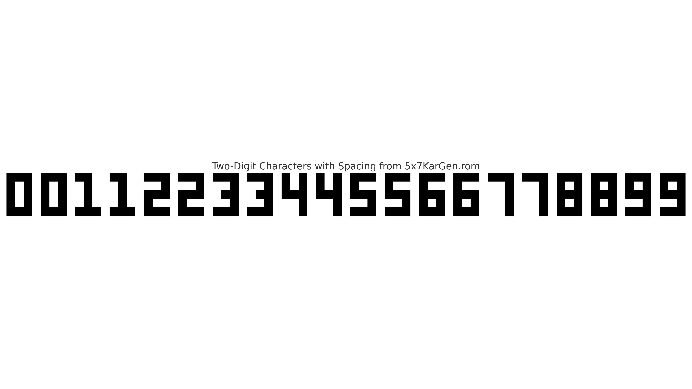

# Two-Digit Display on a Single 5x7 Matrix Using Character Halves

This project showcases an efficient technique for displaying two-digit decimal numbers on a single **5x7 matrix display**, such as the TIL305, with minimal hardware and logic.

## Key Idea
Each digit (0–9) is stored in a ROM as a **3-column by 5-row** bitmap — essentially the left or right half of a character. To display a two-digit number, the system dynamically composes the final shape by combining:

- The **upper 3 bits** (bit 6 to 4) from the tens digit,
- The **lower 3 bits** (bit 2 to 0) from the units digit.

No explicit separator is needed — bit 3 (the middle column) is always zero, naturally providing spacing between digits.

## Core Display Logic
The following Verilog line is the heart of the rendering process:

```verilog
CATHODE[6:0] = ~((rom[tens*6 + scr10 + row] & 7'h70) |
                 (rom[units*6 + scr1 + row] & 7'h0F));
```

Where:
- `rom[...]` accesses the bitmap for each digit,
- `scr10` and `scr1` provide sub-digit scrolling,
- `row` is the current scanline (0 to 4),
- `~` inverts the bits for active-low LED driving.

This line builds each row of the two-digit character by merging two partial 3-bit patterns with an implicit center gap.

## Advantages
- Requires only **5 matrix columns** to display any number from 00 to 99.
- Uses minimal ROM: just 10 digit definitions (3x5 pixels each).
- Ideal for low-pin-count FPGA modules like the **Lattice iCEstick**.
- Visually clear and compact with clean scrolling.

## Visual Example
Below is a visual representation of the combined character patterns:



## Files Included
- `TIL305.v` – Verilog source code
- `TIL305.pcf` – Pin constraint file for iCEstick
- `5x7KarGen.rom` – ROM file containing digit bitmaps
- `TwoDigitCharacters_Spaced.png` – Visual layout of characters

---

Created by Zoli – shared as part of the JLCPCB Open-Source Engineers campaign.
